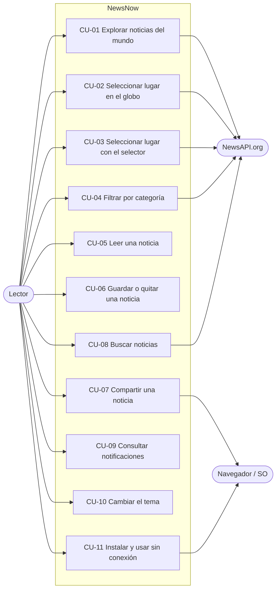

# 03 · Casos de uso

## 1. Actores

| Actor | Tipo | Descripción |
| --- | --- | --- |
| Lector | Principal | Persona que usa la app sin registrarse |
| NewsAPI.org | Secundario (sistema) | Provee titulares y resultados de búsqueda |
| Navegador / sistema operativo | Secundario (sistema) | Provee instalación, compartir, portapapeles y service worker |

## 2. Diagrama general

## 3. Casos de uso detallados

### CU-01 · Explorar noticias del mundo

| Campo | Detalle |
| --- | --- |
| Actor | Lector |
| Requisitos | RF-14, RF-18, RF-19, RF-20, RF-22, RF-30 |
| Precondición | La app está abierta en la ruta `/` |
| Postcondición | Se muestran los titulares mundiales y quedan en caché |

**Flujo principal**

1. El lector abre la aplicación.
2. El sistema muestra el globo y esqueletos de carga.
3. El sistema solicita los titulares mundiales y las tendencias al proxy.
4. El sistema normaliza los artículos y muestra banner, destacada, tendencias y rejilla "Lo último".
5. El sistema marca en el globo los lugares mencionados en los titulares.
6. El lector pulsa "Ver más noticias" para ampliar la rejilla.

**Flujos alternos**

- **3a. Datos recientes en caché (menos de 10 minutos):** el sistema los muestra sin consultar al proxy.
- **3b. Sin conexión:** el sistema muestra la última copia guardada; si no existe, el estado "Sin conexión" con Reintentar.
- **3c. Límite de cuota alcanzado:** el sistema muestra "Se alcanzó el límite de consultas".
- **4a. Sin artículos:** el sistema muestra un estado vacío con la acción "Elegir otro lugar".

### CU-02 · Seleccionar lugar en el globo

| Campo | Detalle |
| --- | --- |
| Actor | Lector |
| Requisitos | RF-01 a RF-04, RF-12, RF-15, RF-35 |
| Precondición | El globo está visible y el navegador admite WebGL |
| Postcondición | El país elegido es el lugar activo y la URL es `/c/xx` |

**Flujo principal**

1. El lector gira el globo arrastrando.
2. El lector pasa el cursor sobre un país; el sistema muestra su bandera y nombre.
3. El lector hace clic en el país.
4. El sistema actualiza la URL, la cámara vuela al país y lo ilumina.
5. El contenido anterior del feed sale; al terminar el vuelo aparece el del país.
6. El sistema muestra un aviso "Mostrando noticias de …" y las estadísticas del lugar.

**Flujos alternos**

- **3a. Clic sobre el océano:** no ocurre nada.
- **5a. El país no tiene titulares oficiales o vienen vacíos:** el sistema busca artículos que lo mencionen (reglas RN-03 y RN-04).
- **6a. Dispositivo móvil:** además aparece la hoja inferior con las 3 últimas noticias.
- **Regreso:** el lector pulsa Esc, "Volver a Mundo" o la miga "Mundo".

### CU-03 · Seleccionar lugar con el selector

| Campo | Detalle |
| --- | --- |
| Actor | Lector |
| Requisitos | RF-09, RF-10, RF-11, RF-12 |
| Precondición | Ninguna |
| Postcondición | El lugar elegido (mundo, región, país) es el lugar activo |

**Flujo principal**

1. El lector abre el selector desde el botón de lugar, "Explorar países" o "Explorar".
2. El sistema abre un diálogo con el foco en el buscador y la lista completa.
3. El lector escribe parte del nombre.
4. El sistema filtra ignorando tildes y mayúsculas.
5. El lector elige con las flechas y Enter, o con un clic.
6. El sistema cierra el diálogo, navega al lugar y desplaza al inicio.

**Flujos alternos**

- **4a. Sin coincidencias:** el sistema muestra "Ningún lugar coincide con …".
- **Ciudad:** desde la vista de un país, el lector pulsa el chip de una ciudad y el sistema navega a `/c/xx/ciudad`.

### CU-04 · Filtrar por categoría

| Campo | Detalle |
| --- | --- |
| Actor | Lector |
| Requisitos | RF-17 |
| Precondición | Hay un lugar activo |
| Postcondición | El feed muestra solo la categoría elegida y la URL incluye `?cat=` |

**Flujo principal**

1. El lector pulsa un chip de categoría o una tarjeta de "Explora por categoría".
2. El sistema actualiza la URL sin añadir una entrada al historial.
3. El sistema consulta y muestra las noticias de esa categoría para el lugar activo.

**Flujos alternos**

- **3a. Sin resultados:** el sistema ofrece "Quitar filtro".
- **1a. La tarjeta ya estaba activa:** el sistema vuelve a Portada.

### CU-05 · Leer una noticia

| Campo | Detalle |
| --- | --- |
| Actor | Lector |
| Requisitos | RF-23 |
| Precondición | La noticia se cargó en esta sesión o está guardada |
| Postcondición | El lector ve el extracto y puede ir a la fuente |

**Flujo principal**

1. El lector pulsa el titular de una tarjeta.
2. El sistema abre `/a/id` con una transición de la imagen.
3. El sistema muestra fuente, fecha, título, autor, imagen, descripción y extracto.
4. El lector se desplaza; la barra de progreso avanza.
5. El lector pulsa "Leer en la fuente"; el sistema abre el artículo original en otra pestaña.

**Flujos alternos**

- **2a. El artículo no está en memoria ni guardado** (por ejemplo, enlace abierto en otra sesión): el sistema muestra "No encontramos esta noticia" y un botón a la portada.
- **Volver:** si hay historial dentro de la app retrocede; si no, va a la portada.

### CU-06 · Guardar o quitar una noticia

| Campo | Detalle |
| --- | --- |
| Actor | Lector |
| Requisitos | RF-24 |
| Postcondición | La lista de guardados del dispositivo se actualiza |

**Flujo principal**

1. El lector pulsa el marcador de una tarjeta o del lector.
2. El sistema añade la noticia al inicio de los guardados y confirma "Guardada para leer después".
3. El lector abre "Guardados" y ve la noticia.

**Flujos alternos**

- **1a. La noticia ya estaba guardada:** el sistema la quita y confirma "Quitada de guardados".
- **3a. Lista vacía:** el sistema muestra "Aún no has guardado nada" con el botón "Explorar noticias".

### CU-07 · Compartir una noticia

| Campo | Detalle |
| --- | --- |
| Actores | Lector, Navegador / SO |
| Requisitos | RF-25 |

**Flujo principal**

1. El lector pulsa Compartir.
2. El sistema abre el diálogo nativo de compartir con título y enlace de la fuente.
3. El lector elige un destino.

**Flujos alternos**

- **2a. El navegador no admite compartir:** el sistema copia el enlace y avisa "Enlace copiado al portapapeles".
- **3a. El lector cancela:** no se muestra ningún aviso.
- **2b. Tampoco se puede copiar:** el sistema avisa "No se pudo compartir el enlace".

### CU-08 · Buscar noticias

| Campo | Detalle |
| --- | --- |
| Actores | Lector, NewsAPI.org |
| Requisitos | RF-26, RF-30 |
| Postcondición | Se muestran hasta 30 resultados y la URL es `/search?q=` |

**Flujo principal**

1. El lector escribe en el buscador de la barra superior y pulsa Enter.
2. El sistema navega a `/search?q=…` y muestra esqueletos.
3. El sistema consulta al proxy y muestra el total y las tarjetas de resultados.

**Flujos alternos**

- **1a. Menos de 2 caracteres:** el sistema muestra temas sugeridos y no consulta.
- **3a. Sin resultados:** el sistema sugiere revisar la ortografía o usar términos más generales.
- **3b. Error:** el sistema muestra el estado de error correspondiente.

### CU-09 · Consultar notificaciones

| Campo | Detalle |
| --- | --- |
| Actor | Lector |
| Requisitos | RF-27 |

**Flujo principal**

1. El sistema registra una notificación cuando carga el titular principal de un lugar en Portada.
2. El lector pulsa la campana; el sistema muestra la lista con las no leídas marcadas.
3. El lector pulsa una notificación; el sistema abre la noticia.
4. Al cerrar el panel, el sistema marca todas como leídas.

**Flujo alterno**

- **2a.** El lector pulsa "Borrar todo"; el sistema vacía la lista.

### CU-10 · Cambiar el tema

| Campo | Detalle |
| --- | --- |
| Actor | Lector |
| Requisitos | RF-28 |

1. El lector pulsa el botón de tema.
2. El sistema pasa al siguiente tema (sistema → oscuro → claro), lo aplica a la interfaz y al globo, y lo guarda.

### CU-11 · Instalar y usar sin conexión

| Campo | Detalle |
| --- | --- |
| Actores | Lector, Navegador / SO |
| Requisitos | RF-31, RF-32, RF-33 |

**Flujo principal**

1. El lector abre la app; el sistema registra el service worker y avisa "Lista para usarse sin conexión".
2. El lector instala la app desde el navegador.
3. Sin conexión, el lector abre la app; el sistema sirve la interfaz, las noticias y las imágenes en caché.

**Flujos alternos**

- **3a. Lugar no visitado antes:** el sistema muestra el estado "Sin conexión".
- **Nueva versión:** el sistema muestra "Nueva versión disponible"; el lector pulsa Actualizar y la app se recarga.
