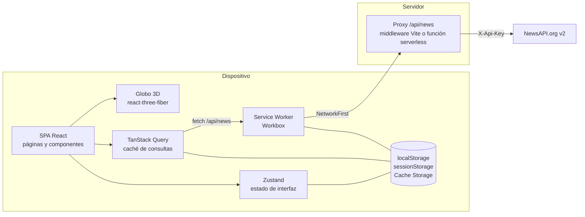
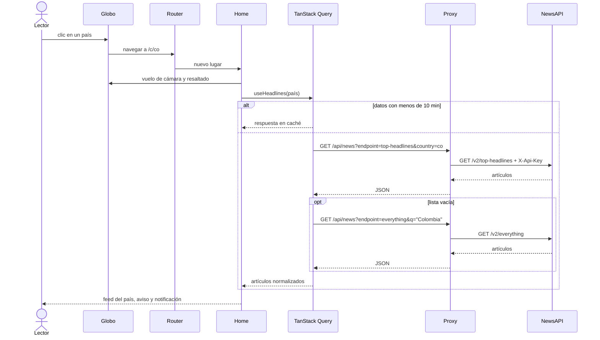

# 04 · Arquitectura del sistema

## 1. Visión general

NewsNow es una SPA en React servida como PWA. El navegador nunca habla con NewsAPI: pide `/api/news` a un proxy sin estado que añade la API key. No hay base de datos; el estado del usuario vive en el dispositivo.



## 2. Estilo y capas

| Capa | Carpeta | Responsabilidad |
| --- | --- | --- |
| Presentación | `src/pages`, `src/components`, `src/styles` | Pantallas, componentes reutilizables y sistema de diseño (tokens CSS) |
| Escena 3D | `src/globe` | Planeta, atmósfera, resaltado, indicadores, cámara y selección por coordenadas |
| Estado | `src/store`, `src/hooks` | Estado de interfaz persistente (tema, guardados, notificaciones), estado de escena y hooks de datos |
| Dominio y datos | `src/lib`, `src/data` | Cliente de noticias, normalización, geografía, detección de lugares, utilidades de fecha y compartir |
| Servidor | `server`, `api` | Proxy compartido y su adaptador serverless |
| Configuración | raíz | Vite, PWA, TypeScript, variables de entorno |

## 3. Estructura de carpetas

```
newnow/
├─ api/news.ts              Función serverless (formato Vercel)
├─ server/newsProxy.ts      Lógica del proxy (lista blanca, inyección de key)
├─ public/                  Favicon e iconos de la PWA
├─ scripts/make-icons.mjs   Generador de iconos
├─ src/
│  ├─ main.tsx              Arranque: estilos, QueryClient persistente, router
│  ├─ App.tsx               Layout: barra lateral, superior e inferior, toasts, service worker
│  ├─ router.tsx            Definición de rutas
│  ├─ pages/                Home, Article, Search, Saved, NotFound
│  ├─ components/           Hero, NewsCard, chrome, place, CountrySelector, feedback, Modal…
│  ├─ globe/                Globe, scene, CameraRig, textures, pick, mirror
│  ├─ hooks/                useNews, usePlace, useMediaQuery
│  ├─ store/                ui (persistente), scene
│  ├─ lib/                  newsapi, geo, hotspots, articles, share, time, types
│  ├─ data/                 regions, cities
│  └─ styles/               tokens, base, components, motion
├─ vite.config.ts           Plugins: React, proxy de noticias, PWA; configuración de pruebas
└─ package.json
```

## 4. Componentes principales

| Componente | Archivo | Función |
| --- | --- | --- |
| Proxy de noticias | `server/newsProxy.ts` | Valida endpoint y parámetros, añade `X-Api-Key`, traduce fallos de red a 502 |
| Cliente de noticias | `src/lib/newsapi.ts` | Decide el endpoint según el lugar, aplica respaldos, normaliza y tipifica errores |
| Geografía | `src/lib/geo.ts` | Construye países desde el atlas, resuelve coordenadas a país, traduce URL a lugar y calcula el encuadre de cámara |
| Detección de lugares | `src/lib/hotspots.ts` | Busca nombres de ciudades y países en titulares |
| Hooks de datos | `src/hooks/useNews.ts` | Consultas con caché de 10 minutos y política de reintento |
| Lugar activo | `src/hooks/usePlace.ts` | Lee lugar y categoría de la URL y expone cómo cambiarlos |
| Estado de interfaz | `src/store/ui.ts` | Tema, guardados, notificaciones (persistentes) y toasts |
| Estado de escena | `src/store/scene.ts` | Conecta el feed con el globo: lugar resaltado y visibilidad del hero |
| Globo | `src/globe/Globe.tsx` | Canvas 3D, eventos de puntero, etiquetas, zoom |
| Portada | `src/pages/Home.tsx` | Orquesta hero, feed y transición entre lugares |

## 5. Flujos clave

### 5.1 Selección de un país



### 5.2 Transición del feed

La portada mantiene dos lugares: `place` (el de la URL, que el hero y el globo siguen al instante) y `feedPlace` (el que muestra el feed). Al cambiar de lugar el feed pasa por las fases `leaving` (180 ms) → `flying` → `idle` (980 ms), de modo que el contenido nuevo llega cuando la cámara se asienta. Con movimiento reducido el cambio es inmediato.

### 5.3 Lectura de un artículo

NewsAPI no permite pedir un artículo por identificador. Cada lista cargada se guarda en memoria y en `sessionStorage` (hasta 300 artículos). El lector busca el artículo ahí y, si no está, en los guardados.

## 6. Estrategia de caché

| Nivel | Qué guarda | Vigencia |
| --- | --- | --- |
| TanStack Query (memoria) | Respuestas por lugar, categoría o búsqueda | Frescas 10 min; se conservan 24 h |
| localStorage `newsnow-cache` | Copia persistida de la caché de consultas | 24 h |
| sessionStorage `newsnow-articles` | Artículos vistos en la sesión | Hasta cerrar la pestaña; 300 artículos |
| Service worker `news-api` | Respuestas 200 de `/api/news` | NetworkFirst, espera 6 s; 60 entradas, 24 h |
| Service worker `images` | Imágenes | CacheFirst; 160 entradas, 7 días |
| Precache | JS, CSS, HTML, fuentes latinas, iconos | Hasta la siguiente versión |
| CDN (producción) | Respuestas 200 del proxy | `s-maxage=600`, `stale-while-revalidate=300` |

## 7. Decisiones de arquitectura

| ID | Decisión | Motivo | Consecuencia |
| --- | --- | --- | --- |
| ADR-01 | Proxy propio en lugar de llamar a NewsAPI desde el navegador | Ocultar la API key y controlar qué se consulta | Se necesita un servidor mínimo (middleware o función serverless) |
| ADR-02 | Una sola implementación del proxy para dev, preview y producción | Evitar divergencias entre entornos | `vite.config.ts` y `api/news.ts` son adaptadores delgados |
| ADR-03 | El lugar y la categoría viven en la URL | Enlaces compartibles y navegación con historial | La portada es una ruta contenedora que no se desmonta |
| ADR-04 | TanStack Query con persistencia local | Respetar la cuota de 100 peticiones/día y permitir lectura sin conexión | Los datos pueden tener hasta 10 minutos de antigüedad |
| ADR-05 | Zustand para el estado de interfaz | API mínima y persistencia selectiva | Tema, guardados y notificaciones quedan solo en el dispositivo |
| ADR-06 | Planeta pintado desde datos vectoriales (`world-atlas`) | No depender de imágenes satelitales y poder cambiar de tema | Resolución 110 m: territorios muy pequeños pueden no ser seleccionables |
| ADR-07 | Respaldo a `everything` cuando no hay titulares por país | Dar cobertura a todos los países | La relevancia depende de una búsqueda textual |
| ADR-08 | Sin backend de usuarios | Simplicidad y privacidad | No hay sincronización entre dispositivos ni push |
| ADR-09 | Actualización del service worker por confirmación (`prompt`) | No recargar a mitad de lectura | El usuario puede quedarse un tiempo en la versión anterior |

## 8. Tecnologías

| Área | Tecnología | Versión |
| --- | --- | --- |
| Lenguaje | TypeScript | 5.9 |
| Interfaz | React, React DOM | 18.3 |
| Empaquetado | Vite | 5.4 |
| Rutas | React Router DOM | 6.30 |
| Datos remotos | TanStack Query (+ persistencia) | 5.104 |
| Estado | Zustand | 5.0 |
| 3D | three, @react-three/fiber, @react-three/drei | 0.169, 8.18, 9.122 |
| Geografía | d3-geo, topojson-client, world-atlas, i18n-iso-countries | 3.1, 3.1, 2.0, 7.14 |
| PWA | vite-plugin-pwa (Workbox) | 0.21 |
| Tipografías | Inter, Newsreader, Sora (variables, autoalojadas) | 5.3 |
| Banderas | flag-icons | 7.5 |
| Pruebas | Vitest | 2.1 |
