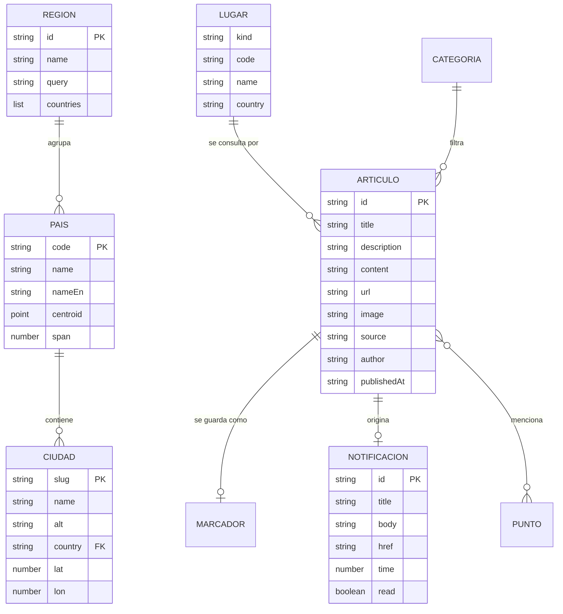

# 05 · Modelo de datos y API

NewsNow no tiene base de datos. Este documento describe las entidades que maneja la aplicación, dónde se almacenan en el dispositivo y el contrato del proxy.

## 1. Modelo conceptual



## 2. Diccionario de datos

### 2.1 Artículo (`Article`)

| Campo | Tipo | Obligatorio | Descripción |
| --- | --- | --- | --- |
| id | texto | Sí | Hash de la URL; identifica el artículo en rutas y guardados |
| title | texto | Sí | Titular sin el sufijo " - Fuente" |
| description | texto | Sí (puede ser vacío) | Resumen |
| content | texto | Sí (puede ser vacío) | Extracto truncado por NewsAPI, sin la marca "[+N chars]" |
| url | texto | Sí | Enlace al artículo original |
| image | texto o nulo | No | URL http(s) de la imagen |
| source | texto | Sí | Nombre del medio o, si falta, el dominio |
| author | texto o nulo | No | Autor |
| publishedAt | texto ISO 8601 | Sí (puede ser vacío) | Fecha de publicación |

### 2.2 Lugar (`Place`)

| Campo | Tipo | Descripción |
| --- | --- | --- |
| kind | `world`, `region`, `country`, `city` | Tipo de lugar |
| code | texto | `world`, id de región, ISO alfa-2 en minúsculas o slug de ciudad |
| name | texto | Nombre en español |
| country | texto (opcional) | ISO alfa-2 del país; presente en países y ciudades |

### 2.3 País (`Country`)

Se construye al arrancar a partir de `world-atlas` (resolución 110 m). Incluye código ISO alfa-2, nombre en español e inglés, geometría, centroide del polígono principal, límites y extensión angular (para decidir el zoom).

### 2.4 Región (`Region`)

Siete regiones fijas: Norteamérica, Latinoamérica, Europa, Oriente Medio, África, Asia y Oceanía. Cada una define centro y distancia de cámara, consulta de búsqueda y lista de países.

### 2.5 Ciudad (`City`)

Catálogo fijo de ciudades principales con slug, nombre, nombre alternativo en inglés, país y coordenadas.

### 2.6 Categoría

| id | Etiqueta |
| --- | --- |
| general | Portada |
| business | Economía |
| technology | Tecnología |
| science | Ciencia |
| health | Salud |
| sports | Deportes |
| entertainment | Cultura |

### 2.7 Notificación (`Notice`)

| Campo | Tipo | Descripción |
| --- | --- | --- |
| id | texto | `top:` + id del artículo; evita duplicados |
| title | texto | "Última hora" o "Titular del día", con el lugar |
| body | texto | Titular |
| href | texto | Ruta del artículo |
| time | número | Marca de tiempo de creación |
| read | booleano | Leída o no |

### 2.8 Punto de interés (`Hotspot`)

Lugar detectado en titulares: id, etiqueta, coordenadas, país, número de titulares que lo mencionan y el primero de ellos. Se calcula en memoria; no se almacena.

## 3. Almacenamiento en el dispositivo

| Almacén | Clave | Contenido | Límite / vigencia |
| --- | --- | --- | --- |
| localStorage | `newsnow-ui` | Tema, guardados y notificaciones | Guardados sin límite; 30 notificaciones |
| localStorage | `newsnow-cache` | Caché de consultas (titulares, tendencias, búsquedas) | 24 h; versión `v1` |
| sessionStorage | `newsnow-articles` | Artículos vistos en la sesión | 300 artículos |
| Cache Storage | `news-api` | Respuestas del proxy | 60 entradas; 24 h |
| Cache Storage | `images` | Imágenes de noticias y banderas | 160 entradas; 7 días |
| Cache Storage | precache de Workbox | Archivos de la aplicación | Por versión |

No se almacenan datos personales. Borrar los datos del sitio en el navegador restablece la aplicación.

## 4. API del proxy

### 4.1 `GET /api/news`

Único endpoint del servidor. Reenvía la consulta a `https://newsapi.org/v2/{endpoint}` añadiendo la cabecera `X-Api-Key`.

**Parámetros de consulta**

| Parámetro | Obligatorio | Descripción |
| --- | --- | --- |
| endpoint | Sí | `top-headlines` o `everything` |
| q | No | Términos de búsqueda |
| country | No | ISO alfa-2 (solo `top-headlines`) |
| category | No | Categoría (solo `top-headlines`) |
| language | No | Idioma de los artículos |
| sources | No | Identificadores de fuentes separados por coma |
| sortBy | No | `publishedAt`, `popularity` o `relevancy` (solo `everything`) |
| searchIn | No | Campos donde buscar |
| from, to | No | Rango de fechas |
| pageSize, page | No | Paginación |

Cualquier otro parámetro, o un valor de más de 500 caracteres, se ignora.

**Ejemplos**

```
GET /api/news?endpoint=top-headlines&country=co&pageSize=40
GET /api/news?endpoint=everything&q=%22Bogot%C3%A1%22%20OR%20%22Bogota%22&language=es&sortBy=publishedAt&pageSize=40
```

**Respuesta correcta (200)** — la de NewsAPI sin modificar:

```json
{
  "status": "ok",
  "totalResults": 128,
  "articles": [
    {
      "source": { "id": null, "name": "El Tiempo" },
      "author": "Redacción",
      "title": "Titular - El Tiempo",
      "description": "Resumen…",
      "url": "https://…",
      "urlToImage": "https://…",
      "publishedAt": "2026-10-04T14:20:00Z",
      "content": "Extracto… [+1234 chars]"
    }
  ]
}
```

**Errores**

| HTTP | code | Origen | Significado | Error en la app |
| --- | --- | --- | --- | --- |
| 400 | parameterInvalid | Proxy | Endpoint no permitido | upstream |
| 401 | apiKeyMissing | Proxy | Falta `NEWSAPI_KEY` en el servidor | apiKeyMissing |
| 401 | apiKeyInvalid, apiKeyDisabled | NewsAPI | Key incorrecta o desactivada | apiKeyInvalid |
| 429 | rateLimited, apiKeyExhausted | NewsAPI | Cuota agotada | rateLimited |
| 502 | upstream | Proxy | No se pudo contactar con NewsAPI | upstream |
| — | — | Navegador | Fallo de red | network |

Formato del cuerpo de error: `{ "status": "error", "code": "…", "message": "…" }`.

**Cabeceras de respuesta**

| Entorno | Cache-Control |
| --- | --- |
| Desarrollo y preview | `no-store` |
| Producción, respuesta 200 | `public, s-maxage=600, stale-while-revalidate=300` |
| Producción, error | `no-store` |

### 4.2 Funciones del cliente (`src/lib/newsapi.ts`)

| Función | Entrada | Salida | Uso |
| --- | --- | --- | --- |
| `getHeadlines(place, category)` | Lugar y categoría | Artículos, total y modo (`headlines` o `search`) | Feed de la portada |
| `getTrending(place)` | Lugar | Artículos | Lista de tendencias |
| `searchNews(query, place?)` | Texto y lugar opcional | Artículos, total y modo | Página de búsqueda |
| `normalize(raw)` | Artículos de NewsAPI | Artículos limpios y sin duplicados | Interna |
| `placeQuery(place)` | Lugar | Consulta e idioma para `everything` | Interna |
