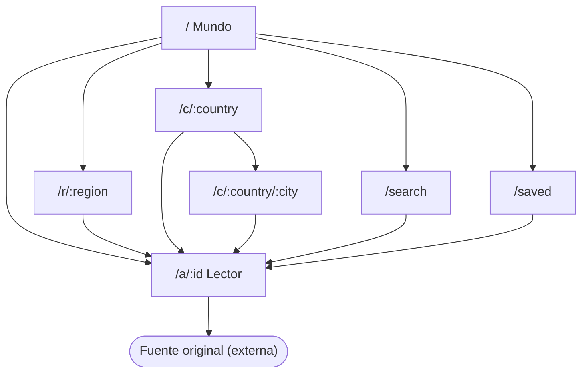

# 06 · Diseño de interfaz y navegación

## 1. Mapa de rutas

| Ruta | Pantalla | Descripción |
| --- | --- | --- |
| `/` | Portada · Mundo | Globo y titulares mundiales |
| `/r/:region` | Portada · Región | Noticias de una de las 7 regiones |
| `/c/:country` | Portada · País | Noticias del país (ISO alfa-2) |
| `/c/:country/:city` | Portada · Ciudad | Noticias de una ciudad del catálogo |
| `/a/:id` | Lector | Vista de lectura de un artículo |
| `/search?q=` | Buscar | Búsqueda por palabras clave |
| `/saved` | Guardados | Lista de lectura local |
| `*` | No encontrada | Ruta o lugar inexistente |

Parámetro adicional en la portada: `?cat=` con `business`, `technology`, `science`, `health`, `sports` o `entertainment`.

Las cuatro rutas de la portada comparten un mismo componente contenedor: cambiar de lugar no desmonta el globo, que conserva su orientación y estado.

## 2. Estructura general de pantalla

| Zona | Escritorio | Móvil |
| --- | --- | --- |
| Barra lateral | Logo, Inicio, Buscar, Guardados (con contador), Explorar países, lista de regiones, atribución a NewsAPI | Oculta |
| Barra superior | Buscador, orbe acompañante, botón de lugar, notificaciones, tema | Logo y acciones |
| Contenido | Página activa | Página activa |
| Barra inferior | Oculta | Inicio, Explorar, Buscar, Guardados |
| Capas | Selector de lugar (diálogo), avisos (toasts) | Además, hoja inferior del lugar |

## 3. Pantallas

### 3.1 Portada

1. **Hero:** globo 3D a un lado y texto al otro.
   - En Mundo: título "Las noticias del mundo, en tus manos", botones "Explorar mundo" y "Últimas noticias", y tres datos (países, lugares en titulares, titulares).
   - Con lugar: migas de pan, bandera y nombre, total de noticias y "Actualizado hace…", chips de ciudades, botones "Ver noticias" y "Volver a Mundo".
2. **Banner:** "Última hora" o "Titular del día" (solo en Portada).
3. **Chips de regiones:** Mundo y las 7 regiones.
4. **Cabecera del feed:** migas, título "Noticias de …", total y tipo de resultados.
5. **Chips de categoría.**
6. **Cuerpo:** noticia destacada + tendencias, y rejilla "Lo último" con "Ver más noticias".
7. **Explora por categoría:** seis tarjetas ilustradas.

### 3.2 Lector

Barra con Volver, Guardar y Compartir; fuente y fecha; título; autor; imagen; descripción y extracto; bloque "Sigue leyendo en …" con el botón "Leer en la fuente"; fecha completa. Una barra superior indica el progreso de lectura.

### 3.3 Buscar

Campo de búsqueda con foco automático. Sin consulta: temas sugeridos. Con consulta: total de resultados y rejilla de tarjetas.

### 3.4 Guardados

Contador de noticias guardadas y rejilla de tarjetas, o estado vacío con el botón "Explorar noticias".

### 3.5 Selector de lugar

Diálogo con buscador y lista de Mundo, regiones y países con bandera y código ISO.

## 4. Componentes de interfaz

| Componente | Uso |
| --- | --- |
| NewsCard | Tarjeta de noticia con imagen, fuente, tiempo, lugar mencionado, guardar y compartir |
| FeaturedNews | Noticia destacada |
| TrendingList | Lista numerada de tendencias |
| BreakingBanner | Banner del titular principal |
| Breadcrumb | Migas Mundo → País → Ciudad |
| RegionChips, CategoryChips, CategoryCards | Filtros de lugar y categoría |
| PlaceStats | Total animado y hora de actualización |
| PlaceSheet | Hoja inferior móvil |
| CountrySelector, Modal | Selector de lugar |
| Skeleton, EmptyState, ErrorState | Estados de carga, vacío y error |
| SmartImage | Imagen con alternativa cuando falta o falla |
| Flag, Icon, CategoryArt | Banderas, iconos e ilustraciones |
| Toaster, NotificationCenter, ThemeSwitcher, Orb | Elementos de la barra superior y avisos |

## 5. Sistema de diseño

- **Tokens:** colores, espaciados, radios, sombras y tipografías se definen como variables CSS en `src/styles/tokens.css`, con valores para tema claro y oscuro.
- **Tipografías:** Inter (interfaz), Newsreader (lectura) y Sora (títulos), variables y autoalojadas.
- **Temas:** `data-theme` en el elemento raíz; color de tema `#060a18` (oscuro) y `#f3f6fd` (claro).
- **Movimiento:** entradas escalonadas, transiciones de vista entre listado y lector, parallax del planeta y contador animado; todo se desactiva con movimiento reducido.
- **Estilos:** `base.css` (reinicio y elementos), `components.css` (componentes), `motion.css` (animaciones).

## 6. Accesibilidad

| Aspecto | Implementación |
| --- | --- |
| Alternativa al globo | El selector de lugar, la barra lateral y los chips permiten llegar a cualquier lugar sin usar el canvas |
| Teclado | Enlace "Saltar al contenido"; selector operable con flechas y Enter; Esc cierra paneles y vuelve a Mundo |
| Foco | Detener el foco sobre un titular enciende su lugar en el globo, igual que el cursor |
| Roles y estados | `nav`, `main`, `article`, `role="search"`, `combobox`/`listbox`, `progressbar`, `alert`, `status`, `aria-pressed`, `aria-current`, `aria-busy`, `aria-live` |
| Lector de pantalla | El canvas tiene etiqueta descriptiva; los contadores animados anuncian solo el valor final; los elementos decorativos llevan `aria-hidden` |
| Movimiento | Se respeta `prefers-reduced-motion` |
| Táctil | Etiqueta temporal del país tocado; hoja inferior arrastrable |

Pendiente: auditoría formal WCAG 2.1 AA (contraste, orden de foco y pruebas con lector de pantalla). Ver HU-40 en el backlog.

## 7. Mensajes del sistema

| Situación | Mensaje |
| --- | --- |
| Cambio de lugar | "Mostrando noticias de {lugar}" / "Mostrando noticias de todo el mundo" |
| Guardar | "Guardada para leer después" / "Quitada de guardados" |
| Compartir | "Enlace copiado al portapapeles" / "No se pudo compartir el enlace" |
| PWA | "Lista para usarse sin conexión" / "Nueva versión disponible" |
| Límite de cuota | "Se alcanzó el límite de consultas" |
| Falta la key | "Falta la API key de NewsAPI" |
| Key inválida | "La API key no es válida" |
| Sin red | "Sin conexión" |
| Fallo del servicio | "No se pudieron cargar las noticias" |
| Sin resultados | "No hay noticias de {categoría} para {lugar}" / "Sin resultados para «{consulta}»" |
| Artículo no disponible | "No encontramos esta noticia" |
